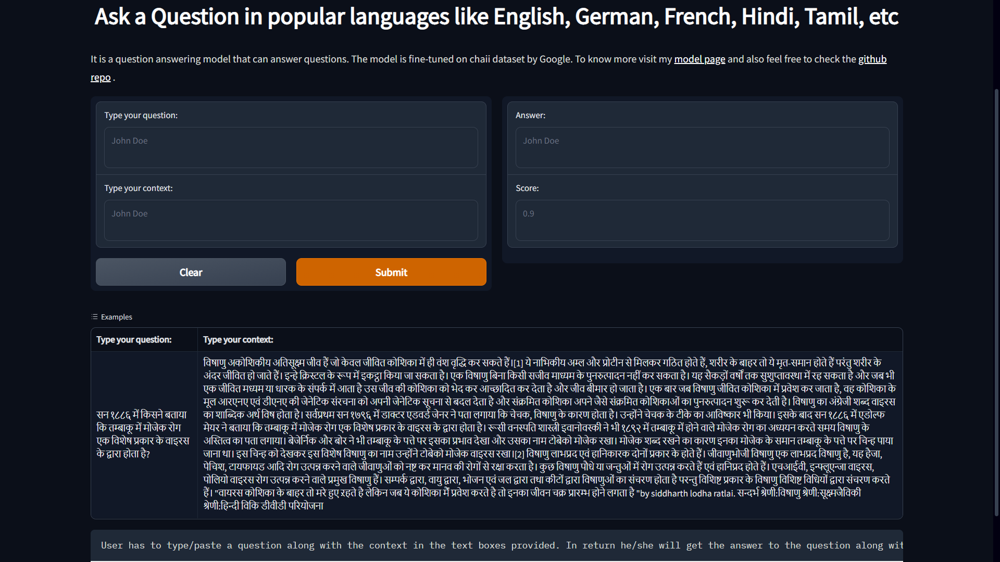

# <U>**CHAI-LETS ANSWER IN HINDI AND TAMIL.**</U>
## Extractive Question Answering Bot.

> [App link](https://huggingface.co/spaces/SmartPy/chaii-qa-task)

### Dataset used 
- chaii by google
- complete EDA of the dataset can be found here [EDA](https://www.kaggle.com/abhishek/chaii-eda-baseline)

### Model link
- [SmartPy/bert-finetuned-squad-chaii](https://huggingface.co/SmartPy/bert-finetuned-squad-chaii)

### Model Description
- This model is a fine-tuned BERT model on the chaii dataset.
- It is a multilingual model trained on many languages like English, Hindi, German, French, etc.
- User has to input the question and the context in the same language and the model will give the answer in the same language with the confidence score.
  
### Results and observation
- The model is able to give the correct answer in most of the cases.
- Model has acheived exact match score of 82.14 on the validation set.

