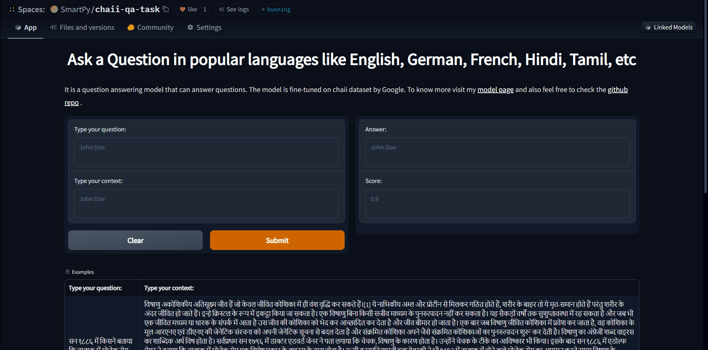

# <U>**CHAI-LETS ANSWER SOME QUESTION.**</U>

## Project description
- Extractive Question Answering Bot
- Answers question in multiple languages including **Hindi** and **Tamil**.
- Feel free to play with the bot and don't forget to like the space.
> [App link](https://huggingface.co/spaces/SmartPy/chaii-qa-task)

### Dataset used 
- [chaii](https://www.kaggle.com/c/chaii-hindi-and-tamil-question-answering) by google
- complete EDA of the dataset can be found here [EDA](https://chaii-eda.netlify.app/)

### Model link
- [SmartPy/bert-finetuned-squad-chaii](https://huggingface.co/SmartPy/bert-finetuned-squad-chaii)

### Model Description
- This model is a fine-tuned BERT model on the chaii dataset.
- It is a multilingual model trained on many languages like English, Hindi, German, French, etc.
- User has to input the question and the context in the same language and the model will give the answer in the same language with the confidence score.
  
### Results and observation
- The model is able to give the correct answer in most of the cases.
- Model has acheived exact match score of 82.14 on the validation set.

### Libraries and Framework used
- [transformers](https://huggingface.co/)
- [Pytorch](https://pytorch.org/)
- [Dataset](https://huggingface.co/docs/datasets/)
- [matplotlib](https://matplotlib.org/)
- [pandas](https://pandas.pydata.org/)
- [numpy](https://numpy.org/)